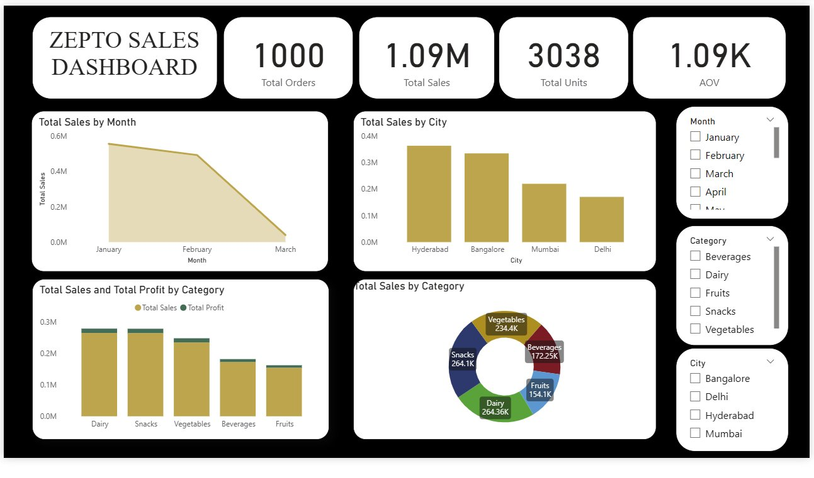

# 🛒 Zepto Sales Dashboard — Power BI Project


---

## 📌 Project Overview

This project presents an **interactive Power BI Sales Dashboard** built using a simulated Zepto quick-commerce sales dataset. The dashboard provides deep insights into sales performance, category distribution, city-wise revenue, and monthly trends — helping business stakeholders make data-driven decisions.

---

## 📊 Dashboard Preview



---

## 🎯 Key Metrics Tracked

| Metric | Value |
|---|---|
| Total Orders | 1,000 |
| Total Sales | ₹1.09M |
| Total Units Sold | 3,038 |
| Average Order Value (AOV) | ₹1.09K |

---

## 📈 Dashboard Visuals

- **Total Sales by Month** — Area chart showing monthly revenue trend (Jan–Mar 2025)
- **Total Sales by City** — Bar chart comparing Hyderabad, Bangalore, Mumbai, Delhi
- **Total Sales & Profit by Category** — Grouped bar chart (Sales vs Profit per category)
- **Total Sales by Category** — Donut chart with category-wise revenue split
- **Slicers** — Interactive filters for Month, Category, and City

---

## 📁 Project Structure

```
zepto-sales-powerbi/
│
├── zepto_sales.pbix                  # Power BI report file
├── zepto_sales_flat_dataset.xlsx     # Source dataset (1000 rows, 42 columns)
├── dashboard_screenshot.png          # Dashboard preview image
├── data_dictionary.md                # Column definitions and descriptions
└── README.md                         # Project documentation (this file)
```

---

## 🗂️ Dataset Summary

- **File:** `zepto_sales_flat_dataset.xlsx`
- **Sheet:** `Zepto_Sales_Flat`
- **Rows:** 1,000 orders
- **Columns:** 42 fields
- **Time Period:** January – March 2025
- **Cities Covered:** Hyderabad, Bangalore, Mumbai, Delhi
- **Categories:** Dairy, Snacks, Vegetables, Beverages, Fruits

For full column descriptions, see [`data_dictionary.md`](data_dictionary.md)

---

## 🛠️ Tools Used

| Tool | Purpose |
|---|---|
| Microsoft Power BI Desktop | Dashboard creation & visualization |
| Microsoft Excel (.xlsx) | Data source / flat file |
| Power Query | Data loading and transformation |
| DAX | Calculated measures (AOV, Total Sales, etc.) |

---

## 🚀 How to Run This Project

1. **Clone this repository**
   ```bash
   git clone https://github.com/tharunshree13/zepto-sales-powerbi.git
   cd zepto-sales-powerbi
   ```

2. **Open the Power BI file**
   - Open `zepto_sales.pbix` using **Power BI Desktop**

3. **Refresh the data source** *(if needed)*
   - Go to `Home → Transform Data → Data Source Settings`
   - Update the file path to your local `zepto_sales_flat_dataset.xlsx`
   - Click `Refresh`

4. **Explore the dashboard**
   - Use the slicers (Month, Category, City) to filter the visuals interactively

---

## 💡 Key Insights

- **Hyderabad** recorded the highest total sales among all cities
- **January** had the highest monthly revenue, showing a declining trend through March
- **Dairy** and **Snacks** are the top-performing categories by sales value
- **AOV of ₹1,090** indicates moderate basket size for quick-commerce orders

---

## 👤 Author

**Tharun S**
- 🎓 B.E. Artificial Intelligence & Data Science — VMKV Engineering College, Salem (2026)
- 💼 Aspiring Data Scientist
- 🔗 GitHub: [github.com/tharunshree13](https://github.com/tharunshree13)

---

## 📄 License

This project is for educational and portfolio purposes only.
